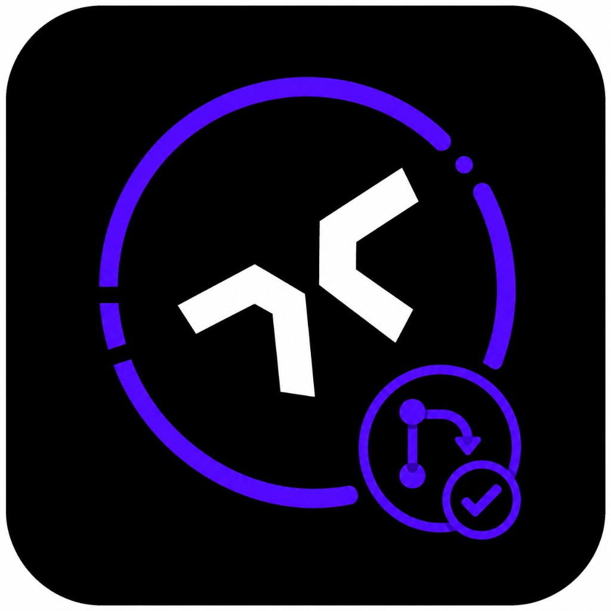

<p align="center">
  
</p>

# Staff Engineer PR Reviewer

Automated pull request reviews powered by Claude. Drop into any GitHub or Azure DevOps repo with a single `npx` command — no checkouts, no builds, no bespoke action to maintain. Posts a structured code review (inline + summary) on every opened or updated PR.

## What it reviews

Focused review of **changed lines only** — high signal, low noise. Reviews are written in **Norwegian (bokmål)**. It skips pre-existing issues, style nits, and unrelated files.

| Priority       | What it flags                                               |
| -------------- | ----------------------------------------------------------- |
| Security       | Injection, XSS, auth gaps, secrets, unsafe handling of data |
| Correctness    | Bugs and contract mistakes introduced in the diff           |
| Readability    | New/changed code that is genuinely hard to follow           |
| Debug noise    | `console.log` / `debugger` left in changed production code  |
| Hardcoded text | User-facing strings that should be i18n or config           |

**Review output:**

1. Sammendrag (2–3 setninger)
2. Funn (med alvorlighetsgrad: critical, major, minor)
3. Konklusjon: **GODKJENN** · **GODKJENN MED SMÅTING** · **BE OM ENDRINGER** · **BLOKKER**

Both platforms post up to 8 **inline** comments on critical/major/minor items in the diff. GitHub uses a formal review (`pulls.createReview`) with an event mapped from the verdict (`APPROVE`, `REQUEST_CHANGES`, or `COMMENT`). Azure posts inline thread comments and casts a reviewer vote (`Approved` for approve, `Rejected` for request-changes, no vote for comment).

## Quick start

The package is installed directly from GitHub via `npx` — no npm registry, no extra auth, no `npm install` in your repo. All consumers always track the reviewer repo's default branch; there is no version pinning. In your target repository:

```bash
npx github:henriksvendsgard/staff-engineer-pr-reviewer init
```

The wizard detects whether you're on GitHub or Azure DevOps, asks a few questions (target branches, Node version), and writes the workflow/pipeline file for you. Then add the `ANTHROPIC_API_KEY` secret, commit the generated file, and open a PR.

Verify the setup at any time:

```bash
npx github:henriksvendsgard/staff-engineer-pr-reviewer doctor
```

## CLI commands

| Command                                                         | What it does                                                                      |
| --------------------------------------------------------------- | --------------------------------------------------------------------------------- |
| `npx github:henriksvendsgard/staff-engineer-pr-reviewer init`   | Interactive wizard — detects the platform and generates the right workflow file.  |
| `npx github:henriksvendsgard/staff-engineer-pr-reviewer doctor` | Checks the current project's setup and reports anything missing or misconfigured. |
| `npx github:henriksvendsgard/staff-engineer-pr-reviewer github` | Runs the GitHub reviewer (called by the generated workflow inside CI).            |
| `npx github:henriksvendsgard/staff-engineer-pr-reviewer azure`  | Runs the Azure DevOps reviewer (called by the generated pipeline inside CI).      |
| `npx github:henriksvendsgard/staff-engineer-pr-reviewer local`  | Reviews your uncommitted changes (or a specific SHA) and prints the result.       |

## GitHub Actions

`init` generates a workflow that looks like this:

```yaml
name: PR Review

on:
  pull_request:
    types: [opened, synchronize, reopened]
    branches:
      - main

permissions:
  contents: read
  pull-requests: write

jobs:
  review:
    runs-on: ubuntu-latest
    steps:
      - uses: actions/setup-node@v4
        with:
          node-version: "22"
      - run: npx --yes github:henriksvendsgard/staff-engineer-pr-reviewer github
        env:
          INPUT_GITHUB-TOKEN: ${{ secrets.GITHUB_TOKEN }}
          INPUT_ANTHROPIC-API-KEY: ${{ secrets.ANTHROPIC_API_KEY }}
          ANTHROPIC_MODEL: ${{ vars.ANTHROPIC_MODEL }}
          ANTHROPIC_THINKING: ${{ vars.ANTHROPIC_THINKING }}
```

No `checkout`, no `npm ci`, no build step in the consuming repo. The package and its dependencies are fetched on the fly by `npx`, the reviewer talks directly to the GitHub API for the diff, and `GITHUB_TOKEN` is provided automatically by Actions.

Required setup in the target repository:

1. **Secret**: `ANTHROPIC_API_KEY` (Settings → Secrets and variables → Actions → New repository secret).
2. **Permissions**: the generated workflow declares `pull-requests: write` at the job level. If your org enforces stricter defaults you may also need to allow `Read and write permissions` under Settings → Actions → General.

## Azure DevOps

`init` generates a pipeline that looks like this:

```yaml
trigger: none

pr:
  branches:
    include:
      - main

variables:
  ANTHROPIC_MODEL: ""
  ANTHROPIC_THINKING: ""

jobs:
  - job: PRReview
    pool:
      vmImage: ubuntu-latest
    steps:
      - task: NodeTool@0
        inputs:
          versionSpec: "22.x"
      - script: npx --yes github:henriksvendsgard/staff-engineer-pr-reviewer azure
        env:
          ANTHROPIC_API_KEY: $(ANTHROPIC_API_KEY)
          AZURE_DEVOPS_PAT: $(AZURE_DEVOPS_PAT)
          ANTHROPIC_MODEL: $(ANTHROPIC_MODEL)
          ANTHROPIC_THINKING: $(ANTHROPIC_THINKING)
          AZURE_DEVOPS_ORG: my-org
          AZURE_DEVOPS_PROJECT: my-project
          AZURE_DEVOPS_REPO_ID: my-repo
          AZURE_DEVOPS_PR_ID: $(System.PullRequest.PullRequestId)
```

Required setup in the target project:

1. **Personal access token** with scopes `Code: Read & Write` + `Pull Request Threads: Read & Write` (User Settings → Personal access tokens). The `Code: Read & Write` scope is required for the reviewer vote API (approve/reject); `Pull Request Threads: Read & Write` covers the inline comment threads. If you only grant thread scope, reviews will still post but no vote will be cast.
2. **Pipeline variables** (mark both as secret):
   - `ANTHROPIC_API_KEY` — your Anthropic key
   - `AZURE_DEVOPS_PAT` — the PAT from step 1
3. Wire the pipeline to the project (Pipelines → New pipeline → existing YAML) and open a PR.

`$(System.PullRequest.PullRequestId)` is set automatically by Azure DevOps on PR builds.

## Running locally

You can run the reviewer against your local working tree without touching CI:

```bash
# uncommitted changes vs HEAD
npx github:henriksvendsgard/staff-engineer-pr-reviewer local

# a specific commit or ref
npx github:henriksvendsgard/staff-engineer-pr-reviewer local HEAD~1
```

The local CLI reads `ANTHROPIC_API_KEY` from your environment (or a `.env` / `.env.local` in cwd) and renders the review interactively (summary block + inline comments + final verdict) — useful for previewing what the bot would say before pushing.

All user-facing CLI commands (`init`, `doctor`, `local`) are built on [`citty`](https://github.com/unjs/citty) for argument parsing and [`@clack/prompts`](https://github.com/bombshell-dev/clack) for prompts, spinners, and styled output. The CI reviewers (`github`, `azure`) log through `@actions/core` and plain stdout respectively, since clack's interactive UI isn't appropriate inside a CI runner.

## Versioning model

There is no version pinning as of now. Coming later with npm packaging. Every consumer always installs from the default branch of the reviewer repo, so all projects move forward in lockstep.

- **Rolling out a change**: push to the default branch. The next PR build in every consumer picks it up.
- **Staging a change**: change the reviewer repo's default branch in GitHub settings (for example to `develop`) while you test. Consumers automatically follow. Switch back to `main` when ready.

This trades release ceremony for simplicity. If you ever want fine-grained pinning (per-consumer tags, blue/green releases), see the `PACKAGE_REF` constant in `src/cli/templates.ts` and reintroduce a `versionPin` field on the template options.

## Configuration

| Variable             | Description                                                                                                                                                                                                                                                                                                                                                                              |
| -------------------- | ---------------------------------------------------------------------------------------------------------------------------------------------------------------------------------------------------------------------------------------------------------------------------------------------------------------------------------------------------------------------------------------- |
| `LLM_PROVIDER`       | Which LLM provider to use. Accepts `anthropic` (default) or `openai`.                                                                                                                                                                                                                                                                                                                    |
| `ANTHROPIC_API_KEY`  | **Required when `LLM_PROVIDER=anthropic` (default).** Your Anthropic API key.                                                                                                                                                                                                                                                                                                            |
| `ANTHROPIC_MODEL`    | Anthropic model override. Defaults to `claude-haiku-4-5-20251001`.                                                                                                                                                                                                                                                                                                                       |
| `ANTHROPIC_THINKING` | Anthropic extended thinking budget. Set to `false`, `off`, `0` to disable (default), or a number (e.g. `2048`, `4096`) to enable with a specific token budget (minimum `1024`, defaults to `2048` if non-numeric/invalid). When thinking is enabled, the API request temperature is automatically locked to `1.0`. A warning is printed if this is set when using the `openai` provider. |
| `OPENAI_API_KEY`     | **Required when `LLM_PROVIDER=openai`.** Your OpenAI API key.                                                                                                                                                                                                                                                                                                                            |
| `OPENAI_MODEL`       | OpenAI model override. Defaults to `gpt-4o`.                                                                                                                                                                                                                                                                                                                                             |

### Overriding model or thinking budget per repo

The generated GitHub workflow forwards `ANTHROPIC_MODEL` and `ANTHROPIC_THINKING` from **repository variables** (Settings → Secrets and variables → Actions → Variables tab). Set them there to override the defaults without touching the workflow file — leave them unset to fall back to the values baked into the reviewer.

The generated Azure pipeline forwards the same two variables from **pipeline variables** (Pipelines → Library, or pipeline-level variables in the UI). The template declares empty top-level defaults so unresolved overrides become an empty string instead of the literal macro `$(ANTHROPIC_MODEL)`, which would otherwise blow up the Anthropic client.

Examples:

- Use Opus on the PRs that touch your security-critical repo: set `ANTHROPIC_MODEL = claude-opus-4-5-20250929` as a repo/pipeline variable.
- Enable thinking with a 4096-token budget: set `ANTHROPIC_THINKING = 4096`.

To adjust the core prompt rules, check [`src/lib/core/prompt.ts`](src/lib/core/prompt.ts).

## Development

```bash
npm install
npm run build        # compile once
npm run build:watch  # watch mode
npm test             # run tests
npx tsc --noEmit     # type-check only
```

Compiled output goes to `dist/`, mirroring the source layout. The published npm package only ships the compiled `dist/` directory.
